  

# ~ 💖 Welcome to my Profile 💖 ~

*There is a whole new world that you can build with code.*  
*Focused on backend systems, clean interfaces, and practical products.*

 

---

### 🦊 About Me

- 💼 **Role:** Backend Developer (.NET) &nbsp;|&nbsp; ⏳ **Experience:** 1 year
- ⚡ **Stacks:** .NET, React, Next.js, Node.js &nbsp;|&nbsp; 🎯 **Interests:** Distributed systems, UX/UI, Web Dev

---

### 🛠️ Tech Stack

  

---

### 💫 GitHub Stats & Activity

  
  

  

---

### 📫 Connect with Me

  
  
  

